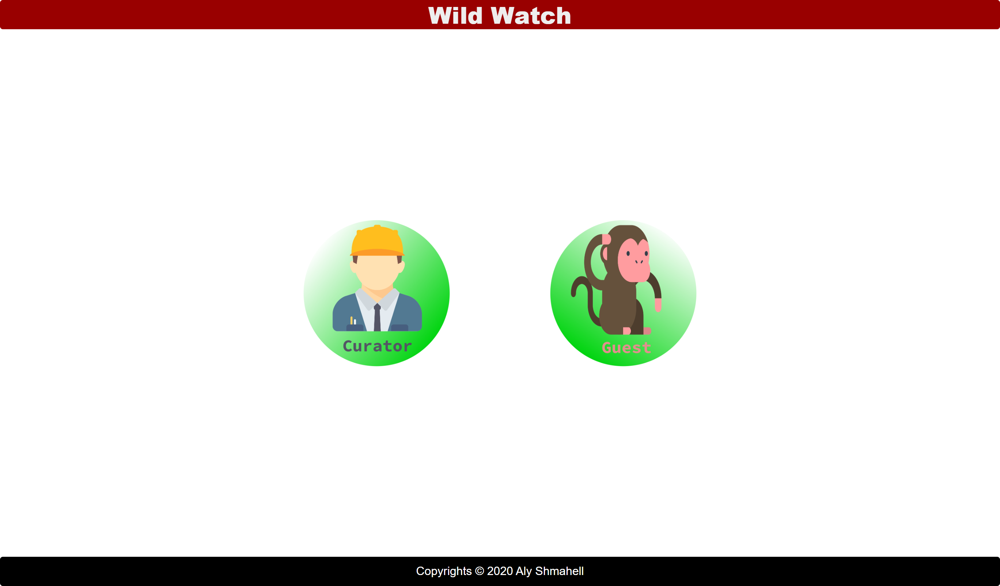
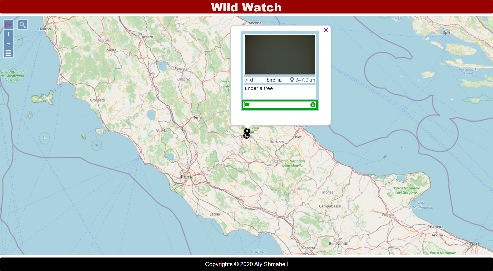
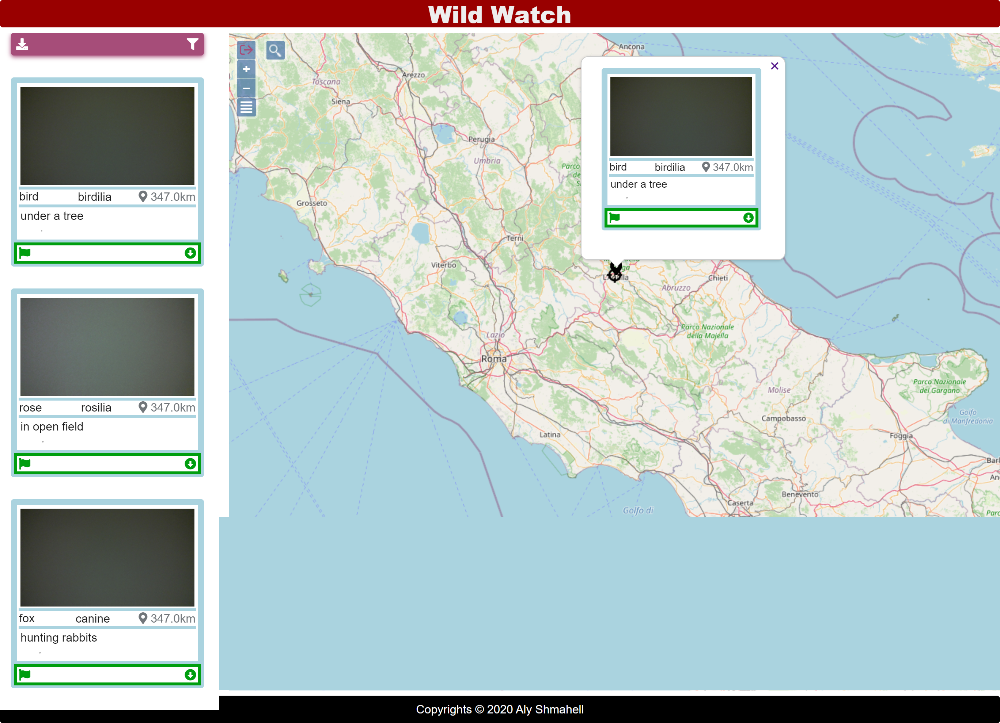
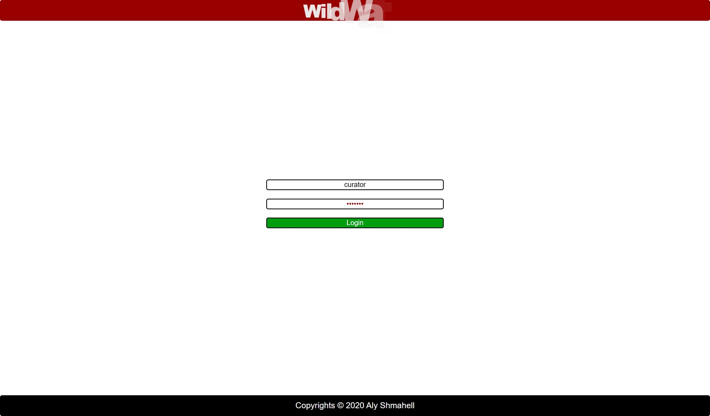

# WildWatch-Web
**WildWatch** is an app which helps people keep track of wildlife, it provides a map to add and view information on wildlife collected by both professionals and enthusiasts. It provides tools to narrow down a certain search pattern, and a way to provide data to a centralized database and get credit for the collected data, the collected data will be used in another open project.

# WildWatch-Web Summary

## Authors
|First Name|Last Name| ID | Role in Project|
|:-:|:-:|:-:|:-:|
|Aly|Shmahell|258912| Lead/Solo Developer|

## Client Side:
- **Technologies:**
    - HTML5
    - CSS3
    - Javascript
- **Libraries:**
    - JQuery
    - JQuery Modal
    - OpenLayers
    - OpenLayers Extensions
    - FontAwesome
    - animejs
    - NoUISlider.js
    - wNumb.js
    - Tag-Picker.js
## Server Side:
- **Technologies:**
    - Python 3.7
- **Frameworks:**
    - Flask
    - Jinja2
- **Libraries:**
    - Numpy
    - Requests
    - Dateutil

<div style="page-break-after: always;"></div>

## Browsers:
|Browser|Version|Compatible|Degrading|Not Compatible|Not Tried|
|:-:|:-:|:-:|:-:|:-:|:-:|
|Google Chrome| 83.0.4 |&#9745;| | | |
|Mozilla Firefox| 78.0.2 |&#9745;| | | |
|Microsoft Edge | 84.0.5 |&#9745;| | | |
|Microsoft Internet Explorer | 11.959 | | &#9745; | | |
|Opera |  | |  | | &#9745; |
|Safari |  | |  | | &#9745; |

<div style="page-break-after: always;"></div>

# WildWatch-Web Known Issues
As WiFi-based locationing is often provided by Google, the vanilla Geolocation API suffers from multiple issues:
- inaccuracy, exacerbated by the restful api's inaccuracy in calculating distances.  

- latency/stability, sometimes it takes minutes to get a stable geolocation read.
The solution to this problem would be to use a paid geolocation service (from Google would be fine).  

References: [Geolocation API](https://developer.mozilla.org/en-US/docs/Web/API/Geolocation_API)
<div style="page-break-after: always;"></div>

# WildWatch-Web Instructions:

### Download
```sh
git clone --depth 1 --single-branch --branch web https://github.com/AlyShmahell/WildWatch wildwatch-web
```

### Pre-Requirements
- python 3.7
- pip for python 3.7
- **wildwatch-restful:** instructions can be found at the restful branch of this repository: [https://github.com/AlyShmahell/WildWatch/tree/restful](https://github.com/AlyShmahell/WildWatch/tree/restful)

### Installation
open a terminal inside **wildwatch-web**, then:
```sh
pip install -r requirements.txt
```

### Operation
```sh
python server.py --this_ip "127.0.0.1" --this_port 5002 --rest_ip "http://127.0.0.1" --rest_port 5001
```

<div style="page-break-after: always;"></div>

# WildWatch-Web API

<a name="server"></a>
##  `Server`: server.py

<a name="server.SessionBorg"></a>
###  SessionBorg 

```python
class SessionBorg()
```

- keeps session state uniform accross all resources
- attributes:
    - _shared_state: requests.Session.

<a name="server.SessionSingleton"></a>
###  SessionSingleton 

```python
class SessionSingleton(SessionBorg)
```

manages session state using SessionBorg

<a name="server.calc_distance"></a>
##### calc\_distance

```python
calc_distance(p1_lon, p1_lat, p2_lon, p2_lat)
```

- calculates distance between two longitude/latitude points on a globe
- parameters:
    - p1_lon: float, longitude of point no. 1
    - p1_lat: float, latitude  of point no. 1
    - p2_lon: float, longitude of point no. 2
    - p2_lat: float, latitude  of point no. 2

<div style="page-break-after: always;"></div>
<a name="server.login_user"></a>

##### login\_user

```python
login_user()
```

- establishes a login session
- inputs:
    - username: string
    - password: string
- calls: `Session.post(<restful-api>/auth)`
- returns:
    - status: boolean

<a name="server.logged_in"></a>

##### logged\_in

```python
logged_in(role=None)
```

- checks whether or not a user is logged in with a certain role
- parameters:
    - role: string

<a name="server.logout_user"></a>

##### logout\_user

```python
logout_user()
```

invalidates current session

<a name="server.index"></a>

##### index

```python
@app.route('/')
index()
```

- allocated logic for `root`
- returns:
    - redirects to `/curator` url if the session is established
    - redirects to `/welcome` url otherwise

<div style="page-break-after: always;"></div>

<a name="server.welcome"></a>

##### welcome

```python
@app.route('/welcome')
welcome()
```

- allocated logic for `/welcome`
- returns:
    - renders `welcome.html` template

<a name="server.login"></a>
##### login

```python
@app.route('/login', methods=['GET', 'POST'])
login()
```

- allocated logic for `/login`
- calls: 
    - on `POST`: `login_user()`
- returns:
    - on success: redirects to `/curator`
    - on failure/`GET`: renders `login.html` template

<a name="server.logout"></a>
##### logout

```python
@app.route('/logout')
logout()
```

- allocated logic for `/logout`
- calls: `logout_user()`
- returns: redirects to `/welcome`

<div style="page-break-after: always;"></div>

<a name="server.noscript"></a>

##### noscript

```python
@app.route('/noscript')
noscript()
```

- allocated logic for `/noscript`
- returns: renders `noscript.html` template
- semantics: graceful degredation in case javascript is disabled

<a name="server.ie"></a>

##### ie

```python
@app.route('/ie')
ie()
```

- allocated logic for `/ie`
- returns: renders `ie.html` template
- semantics: graceful degredation in case of running on Internet Explorer

<div style="page-break-after: always;"></div>

<a name="server.curator"></a>

##### curator

```python
@app.route('/curator')
@logged_in()
curator()
```

- allocated logic for `/curator`
- arguments:
    - text: string
    - mind: iso datetime string
    - maxd: iso datetime string
    - by: string
    - type: array of strings
    - lon: float, longitude
    - lat: float, latitude
    - area: float
- calls: `Session.get(<restful-api>/auth/wildlife)`
- returns:
    - on redirect:
         renders `curator.html` template
    - on xhr/ajax:
         renders `curator-list.html` template

<a name="server.guest"></a>
##### guest

```python
@app.route('/guest')
guest()
```

- allocated logic for `/guest`
- arguments:
    - text: string
    - mind: iso datetime string
    - maxd: iso datetime string
    - by: string
    - type: array of strings
    - lon: float, longitude
    - lat: float, latitude
    - area: float
- calls: `Session.get(<restful-api>/guest/wildlife)`
- returns:
    - on redirect:
         renders `guest.html` template
    - on xhr/ajax:
         renders `guest-list.html` template

<div style="page-break-after: always;"></div>

<a name="server.report_submit"></a>

##### report\_submit

```python
@app.route('/report-submit', methods=['POST'])
report_submit()
```

- allocated logic for `/report-submit`
- inputs: 
    - code: integer
    - wildlifeid: integer
    - text: string
- calls: `Session.post(<restful-api>/guest/report)`
- returns: response.json / status

<a name="server.report_resolve"></a>

##### report\_resolve

```python
@app.route('/report-resolve/<int:reportid>', methods=['PUT'])
@logged_in()
report_resolve(reportid)
```

- allocated logic for `/report-resolve/{reportid}`
- inputs: 
    - cascade: boolean
- calls: `Session.put(<restful-api>/auth/report/{reportid})`
- returns: response.json / status

<a name="server.report_remove"></a>

##### report\_remove

```python
@app.route('/report-remove/<int:reportid>', methods=['DELETE'])
@logged_in()
report_remove(reportid)
```

- allocated logic for `/report-remove/{reportid}`
- arguments: 
    - cascade: boolean
- calls: `Session.delete(<restful-api>/auth/report/{reportid})`
- returns: response.json / status

<div style="page-break-after: always;"></div>

<a name="server.download"></a>

##### download

```python
@app.route('/download/<string:wildlifeid>')
download(wildlifeid)
```

- allocated logic for `/download/{wildlifeid}`
- arguments: 
    - cascade: boolean
- calls: `Session.get(<restful-api>/guest/wildlife/{wildlifeid})`
- returns: {wildlifeid}.zip

<a name="server.downloadall"></a>

##### downloadall

```python
@app.route('/download')
downloadall()
```

- allocated logic for `/download`
- arguments: 
    - cascade: boolean
- calls: `Session.get(<restful-api>/guest/wildlife)`
- returns: data.zip

<div style="page-break-after: always;"></div>

<a name="Styling"></a>

##  `Styling`: app.css
a mix of grid & flexbox was used to establish a responsive style for the website.

<a name="header"></a>

##  `Header`: header.js

<a name="header.$(document).ready()"></a>

##### $(document).ready()

```js
$(document).ready(()=>{
    ...
})
```
- animates header

<a name="nav"></a>
##  `Nav`: nav.js

<a name="header.$(document).ready()"></a>

##### $(document).ready()

```js
$(document).ready(()=>{
    ...
})
```
- handles nav list collapse/expansion.
- provides nav list responsiveness (mobile/desktop).

<div style="page-break-after: always;"></div>

<a name="map"></a>

##  `Map`: map.js

<a name="map.$(document).ready()"></a>

##### $(document).ready()

```js
$(document).ready(()=>{
    ...
})
```
- creates map.
- adds search-box & logout-button to map bar.
- adds daterange-slider to filters modal.
- removes map watermarks.
- handles modal events (open/close/submit).
- handles popup events (open/close/submit).
- handles geolocation events (location change).
- handles filter events (change/submit).
- handles zoom events (zoom-in/zoom-out).
- handles drag events (map drag).
- handles click events (download).

<a name="map.add_point"></a>

##### add_point

```js
function add_point(map, center, icon, crosshairs) {
    ...
}
```
- adds a point `icon` to the `map` according to its `center` location.
- tracks the point for **redraw on refresh** if `crosshairs` flag is false.

<a name="map.remove_points"></a>

##### remove_points

```js
function remove_points(map) {
    ...
}
```
- removes tracked points from `map` in preparation for **redraw on refresh**.

<div style="page-break-after: always;"></div>

<a name="map.refresh"></a>

##### refresh

```js
function refresh(map, url) {
    ...
}
```
- redraws points on the `map` according to current filters, area & location...
- uses ajax request on `url` for partial view refresh:
    - if url is `/guest` then it:
        - removes points from map, by calling `remove_points(map)`.
        - replaces the nav list with html from `guest-list.html`
        - adds new points to the map.
    - if url is `/curator` then it:
        - removes points from map, by calling `remove_points(map)`.
        - replaces the nav list with html from `curator-list.html`
        - adds new points to the map.


<a name="map.calc_radius"></a>

##### calc_radius

```js
function calc_radius(map) {
    ...
}
```
- calculates the radius of the current map area.
- typically called after drag/zoom events.


<a name="map.submit_report"></a>

##### submit_report

```js
function submit_report(event) {
    ...
}
```
- submits a report based on the form data in the modal associated with the `event`


<a name="map.resolve_report"></a>

##### resolve_report

```js
function resolve_report(event) {
    ...
}
```
- submits a report resolution request based on the form data in the modal associated with the `event`


<a name="map.remove_report"></a>

##### remove_report

```js
function remove_report(event) {
    ...
}
```
- submits a report deletion request based on the form data in the modal associated with the `event`


<a name="map.objectifyForm"></a>

##### objectifyForm

```js
function objectifyForm(formArray) {
    ...
}
```
- converts a serialized form into a json object, useful for manipulation of form data before sending requests.

<div style="page-break-after: always;"></div>

# ScreenShots







